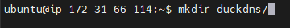
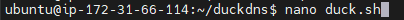
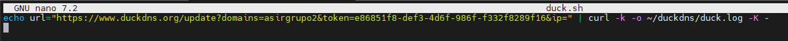
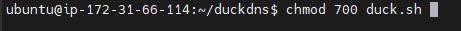
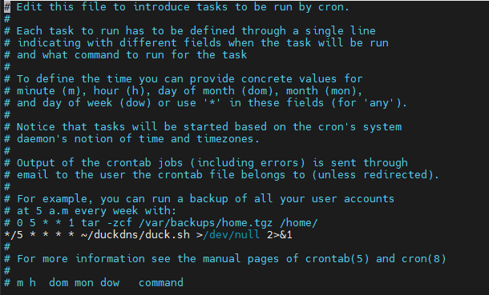
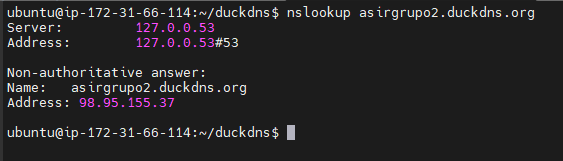
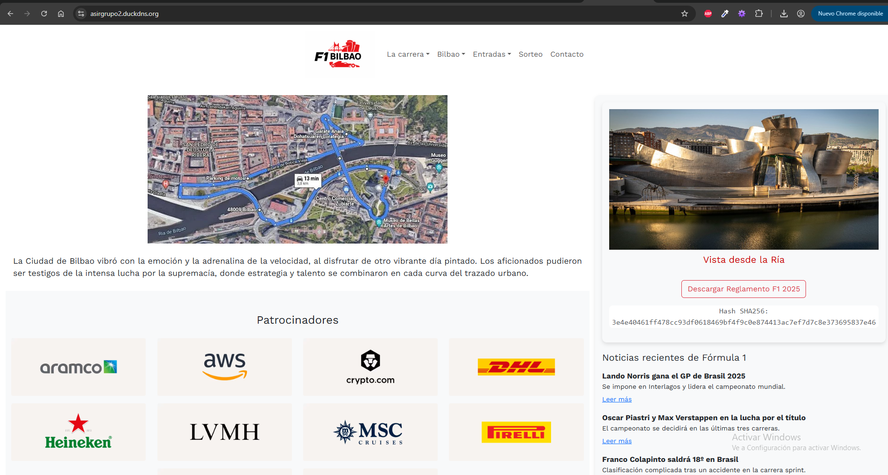
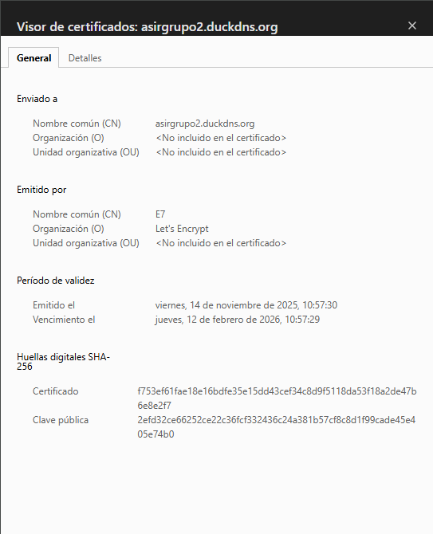

# reto4_grupo2_cloud
## Demostración página web
(En este caso es HTPPS con Github)
https://scriptslayer0.github.io/reto4_grupo2_cloud/

<br><br>
## Instalación Duck DNS en AWS

1. Crear la carpeta DuckDNS
Primero, creamos la carpeta `duckdns`:



2. Crear el script `duck.sh`
Usando `nano`, creamos un archivo llamado `duck.sh`:



Insertamos el siguiente texto en el archivo:



3. Cambiar permisos del script
Cambiamos los permisos del archivo `duck.sh` para que sea ejecutable:



4. Crear la tarea programada
Creamos la tarea programada y seleccionamos la opción 1 (para usar `nano`):



5. Asegurarnos de que el servicio cron esté activo
Verificamos que el servicio `cron` esté habilitado y en ejecución:

```bash
sudo systemctl enable cron
sudo systemctl start cron

# Para revisar el estado del servicio
sudo systemctl status cron
```
6. Finalmente revisamos si esta asignado


<br><br>
## Directorios
```
ubuntu@ip-172-31-66-114:/var/www/javascript$ tree
.
├── JS
│   ├── acceso.js
│   ├── compra_entradas.js
│   ├── index.js
│   └── sorteo.js
├── README.md
├── compra_entradas.html
├── contacto.html
├── images
│   ├── carrousel
│   │   ├── Bilbao-cascoviejo-03.jpg
│   │   ├── Bilbao_ayuntamiento.png
│   │   ├── Bourgeois-1024x802.jpg
│   │   ├── F1-bilbao2.jpg
│   │   ├── Que-ver-en-Bilbao.jpg
│   │   ├── bilbao_alto.jfif
│   │   ├── casco-viejo-2.jpg
│   │   ├── casco_viejo.avif
│   │   ├── f1-bilbao.jpg
│   │   ├── que-visitar-en-bilbao.jpg
│   │   ├── reglamento.jpg
│   │   └── vista-desde-la-ria.jpg
│   ├── circuito
│   │   ├── circuito-bilbao.webp
│   │   ├── el-gp-de-estados-unidos-se-correra-el-proximo-20-DDMGGQTUUVHKDKFX7K6ONYYCR4.avif
│   │   └── horarios-para-el-gp-de-estados-1.jpg
│   ├── equipos
│   │   ├── Logo_Haas_F1.png
│   │   ├── Logo_Williams_F1.png
│   │   ├── Red-Bull-Logo.png
│   │   ├── alpine-cars.png
│   │   ├── aston_martin.jpg
│   │   ├── ferrari.jpg
│   │   ├── mercedes.jpg
│   │   ├── mr-robot.png
│   │   ├── racing-bulls.jpg
│   │   └── stake-sauber.jpg
│   ├── logo
│   │   └── logo.png
│   ├── patrocinadores
│   │   ├── DHL.avif
│   │   ├── Heineken.avif
│   │   ├── LVMH.avif
│   │   ├── MSC.avif
│   │   ├── Pirelli.avif
│   │   ├── Qatar Airways.avif
│   │   ├── aramco.avif
│   │   ├── aws.avif
│   │   ├── crypto.avif
│   │   └── salesforce.avif
│   └── pilotos
│       ├── alexander_albon.jpg
│       ├── carlos_sainz.webp
│       ├── charles_lecrerc.webp
│       ├── esteban_ocon.jpg
│       ├── fernando_alonso.jpg
│       ├── franco_colapinto.png
│       ├── gabriel_bortoleto.jpg
│       ├── george_russell.jpg
│       ├── isack_hadjar.jpg
│       ├── lance_stroll.jpg
│       ├── lando_norris.webp
│       ├── lewis_hamilton.jpg
│       ├── liam_lawson.webp
│       ├── logan_sargeant.png
│       ├── logo.png
│       ├── max__verstappen.webp
│       ├── nico_hulkenberg.jpg
│       ├── oliver_bearman.jpg
│       ├── oscar_piastri.webp
│       ├── pierre_gasly.jpg
│       └── yuki_tsunoda.jpg
├── index.html
├── reglamento_f1
│   └── fia_2025_formula_1_sporting_regulations_-_issue_1_-_2024-07-31.pdf
├── solo_acceso.html
├── sorteo.html
└── styles
    ├── compra_entradas.css
    ├── index.css
    └── sorteo.css

11 directories, 71 files
```

## Muestra página web (En Amazon AWS)



## Certificado HTTPS


